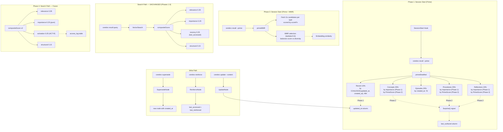

# ADR-007: Recall Recency Enhancement — Surprise-Aware Retrieval with Diversity Guarantees

## Status
Accepted (Phases 1-3 implemented; Phase 4 deferred)

## Supersedes
Phase 4 of this ADR, when accepted and implemented, supersedes the "Read Path: Composite Scoring" section of ADR-003 with respect to the importance and recency signal computations. The weight distribution (0.35/0.25/0.25/0.15) and the relevance/structural signals are unchanged. ADR-003's importance formula `importance * (1 + ln(1 + access_count))` and recency formula `exp(-decay * hours)` are replaced by the ACT-R-based activation model described in Phase 4. Phases 1-3 do not conflict with ADR-003.

Note: ADR-003 references a `citation_bonus` in the importance formula that is absent from the current implementation (`compositeScore()` in `search.go`). This is a pre-existing discrepancy between ADR-003 and the code. Phase 4 inherits this gap — citation_bonus is not incorporated into the ACT-R model.

## Context

When an agent starts a new session, it needs context from its most recent work — memories created or amended since the last session. The current system has a blind spot: `UpdateNode()` changes a memory's content but touches no timestamp. This means:

1. **Updated memories are invisible to recency.** A concept updated 2 hours ago is indistinguishable from one created 3 months ago and never touched, because no timestamp records the edit.
2. **Prime mode has no awareness of recently-changed memories.** `primeStratified()` retrieves concepts/procedures/reflections by importance and episodes by `created_at`. There is no stratum for "what changed recently across all types?"
3. **There is no way to query "what changed recently?"** `ListNodesOpts.Since` filters on `created_at` only.

### Timestamp Semantics Today

The three existing timestamps on the `nodes` table each serve distinct purposes:

| Timestamp | Semantics | Consumers |
|-----------|-----------|-----------|
| `created_at` | When the node was first stored (immutable) | Episode filtering in prime, export metadata |
| `last_accessed` | When the node was last retrieved/used | `compositeScore()` recency signal, `retentionScore()` for GC |
| `last_reinforced` | When the node was explicitly reinforced | Reinforcement tracking |

None of these captures "when was this memory's content last modified?"

**Existing overlap:** `last_accessed` and `last_reinforced` are currently always set together in `ReinforceNode()` (same SQL statement, same `CURRENT_TIMESTAMP` value). They are semantically intended to differ — `last_accessed` for any retrieval use, `last_reinforced` for explicit confirmation — but in the current implementation they are identical. This ADR does not resolve this existing overlap but notes it for awareness. If a future change causes `last_accessed` to be set independently of `last_reinforced` (e.g., auto-access on search), the distinction becomes real.

### Amendment Routing Today

The `/remember` skill routes amendments through three operations:
- **UPDATE** (`cerebro update <id>`) — in-place content change. **Touches NO timestamp.** This is the gap.
- **SUPERSEDE** (`cerebro supersede <old_id>`) — creates a new node with fresh `created_at`. Recency-visible.
- **REINFORCE** (`cerebro reinforce <id>`) — bumps `last_accessed` and `last_reinforced`. Recency-visible via `compositeScore()`.

Only UPDATE is invisible, and UPDATE is the most common amendment for refining existing knowledge (e.g., extending "Phase 3 complete" to "Phase 3 and 4 complete").

### Mathematical Gaps in Current Retrieval

Analysis of the current retrieval model reveals three deeper issues beyond the timestamp gap:

**1. Exponential decay is empirically wrong.** The current recency model `exp(-lambda * t)` is memoryless — it considers only time since last access, not access history. Cognitive science research (Anderson & Schooler 1991, Anderson et al. 2004) demonstrates that memory retrieval follows a **power law**, not exponential decay. A memory accessed 50 times over 3 months retains far more activation than one accessed once 3 months ago, even if both have the same `last_accessed` time. The current model cannot distinguish these cases because it discards access history.

**2. No diversity guarantee in prime mode.** The fixed type-stratified budget (40/30/20/10) prevents cross-type redundancy but not within-type redundancy. Eight concept memories about the database layer could dominate the concepts stratum while authentication and deployment get zero coverage. Fixed stratification is a coarse heuristic for a problem that information retrieval has solved formally via **Maximal Marginal Relevance (MMR)** (Carbonell & Goldstein 1998).

**3. No surprise signal.** The system has no way to express "the agent's model of this memory is stale." When a memory's content changes, the agent that last saw the old version should be informed. This is a well-understood concept in information theory — the **information gain** of surfacing a modified memory is strictly higher than surfacing an unmodified one, because the agent's internal model diverges from reality.

## Decision

Adopt a phased enhancement to the retrieval model, maintaining strict separation between **topical search** (relevance-dominated, unchanged) and **session priming** (awareness of recent changes, diversity, surprise).

Each phase is independently shippable and deployable. Later phases enhance earlier ones but are not required for earlier phases to function.

### Phase 1: Schema Foundation

#### 1a. Add `updated_at` Column

Add a new nullable `DATETIME` column `updated_at` to the `nodes` table.

**Schema migration:**
- Bump `schemaVersion` from `"1"` to `"2"`
- Add a `migrateSchema()` method called from `store.Open()` (not only from `Init()`). This is critical: the normal path for existing databases is `brain.Open()` → `store.Open()`, which does NOT call `applySchema()`. Without `migrateSchema()` in `Open()`, the migration would never run for existing databases, and queries referencing the new columns would fail.
- Migration logic: check current schema version, apply pending `ALTER TABLE` statements, update version. The migration MUST be guarded by a version check AND wrapped in a transaction. The version update is inside the transaction, making the entire migration atomic — either all schema changes and the version bump commit together, or none do. This eliminates partial-migration states from process crashes. (SQLite fully supports `ALTER TABLE ADD COLUMN` inside transactions in WAL mode; rollback correctly removes the columns.)
- Existing rows get `updated_at = NULL` (not backfilled to `created_at`; NULL means "never updated, use `created_at` as proxy via COALESCE")
- Create index: `CREATE INDEX IF NOT EXISTS idx_nodes_updated_at ON nodes(updated_at)`

```go
// store.go — new method, called from Open()
func (s *Store) migrateSchema() error {
    version, err := s.GetMeta("schema_version")
    if err != nil {
        return err
    }

    if version == "1" {
        tx, err := s.db.Begin()
        if err != nil {
            return fmt.Errorf("beginning v1->v2 migration: %w", err)
        }
        defer func() { _ = tx.Rollback() }()

        stmts := []string{
            `ALTER TABLE nodes ADD COLUMN updated_at DATETIME`,
            `ALTER TABLE nodes ADD COLUMN last_surfaced DATETIME`,
            `CREATE INDEX IF NOT EXISTS idx_nodes_updated_at ON nodes(updated_at)`,
            `CREATE INDEX IF NOT EXISTS idx_nodes_last_surfaced ON nodes(last_surfaced)`,
        }
        for _, stmt := range stmts {
            if _, err := tx.Exec(stmt); err != nil {
                return fmt.Errorf("migrating v1->v2: %w", err)
            }
        }

        // Version update MUST be inside the transaction. Using tx.Exec (not s.SetMeta)
        // because SetMeta operates on s.db (the connection), not the transaction handle.
        // This makes the entire migration atomic: crash between DDL and version update
        // causes a full rollback, so the next Open() retries cleanly from v1.
        if _, err := tx.Exec(
            `INSERT INTO schema_meta (key, value) VALUES ('schema_version', '2')
             ON CONFLICT(key) DO UPDATE SET value = excluded.value`,
        ); err != nil {
            return fmt.Errorf("updating schema version to 2: %w", err)
        }

        if err := tx.Commit(); err != nil {
            return fmt.Errorf("committing v1->v2 migration: %w", err)
        }
    }

    return nil
}
```

**Behavior:**
- `UpdateNode()` sets `updated_at = CURRENT_TIMESTAMP` when `opts.Content != nil` (content changed)
- `UpdateNode()` does NOT set `updated_at` for importance-only or metadata-only changes (these are scoring/bookkeeping adjustments, not knowledge refreshes — e.g., metadata includes `promoted_to_global` references from `Promote()`)
- `SupersedeNode()` and `AddNode()` do not set `updated_at` — new nodes have `created_at` and `updated_at = NULL`

**Type changes:**
- Add `UpdatedAt *time.Time` to the `Node` struct (nullable, like `LastReinforced`)
- Update `scanNode()` and `scanNodeFromRows()` to scan the new column
- Update all SELECT queries that scan full node rows to include `updated_at`

**Export/Import:**
- `ExportBundle` inherits `UpdatedAt` via the `Node` struct
- Import code handles missing `updated_at` gracefully (Go's `json.Unmarshal` into `*time.Time` produces nil for absent keys)
- `ExportVersion` remains `"1"` — adding a nullable JSON field is backwards-compatible

**Promote() behavior:** `brain.Promote()` copies a node from project to global store via `AddNode()`. The promoted copy gets `updated_at = NULL` and `last_surfaced = NULL`, which is correct — a promoted copy is a new node in the destination store with its own lifecycle. The source node's update history does not transfer.

#### 1b. Add `last_surfaced` Column

Add a nullable `DATETIME` column `last_surfaced` to track when the agent last saw this memory in a session priming context.

**Rationale:** This enables the surprise signal (Phase 2). The distinction between `last_accessed` and `last_surfaced` is:
- `last_accessed` = the agent explicitly reinforced this memory (deliberate confirmation of relevance)
- `last_surfaced` = the agent was shown this memory in a session briefing (prime mode exposure)

**Critical design decision: `last_surfaced` is updated ONLY in prime mode, NOT in topical search.** An incidental search hit does not mean the agent has absorbed the updated content. The agent may search for "authentication," see a modified memory about "deployment" in the results, and ignore it. Treating that as "surfaced" would suppress surprise for the next session priming, even though the agent never internalized the change. `last_surfaced` specifically tracks "this memory was included in a session briefing where the agent is expected to absorb context."

This also avoids write amplification on the hot search path.

**Schema migration (bundled with 1a):**
- `ALTER TABLE nodes ADD COLUMN last_surfaced DATETIME`
- Create index: `CREATE INDEX IF NOT EXISTS idx_nodes_last_surfaced ON nodes(last_surfaced)`
- Existing rows: `NULL` (unknown when last surfaced)

**Behavior:**
- `primeStratified()` (and `primeMMR()` in Phase 3) updates `last_surfaced` for all returned nodes after selection
- `VectorSearch()` / `Search()` does NOT update `last_surfaced`

**Store method:**
```go
// internal/store/nodes.go — new method
func (s *Store) TouchSurfaced(ids []string) error
```

This is a store-layer batch SQL UPDATE. It should not be implemented ad-hoc in CLI code.

**Type changes:**
- Add `LastSurfaced *time.Time` to the `Node` struct

#### 1c. Extend `ListNodesOpts`

```go
type ListNodesOpts struct {
    Type         NodeType
    Status       string
    Since        *time.Time  // existing: filters on created_at
    SinceChanged *time.Time  // new: filters on COALESCE(updated_at, created_at)
    Limit        int
    OrderBy      string      // existing: "importance", "created_at"
                             // new: "recently_changed"
}
```

When `OrderBy = "recently_changed"`:
- `ORDER BY COALESCE(updated_at, created_at) DESC`

When `SinceChanged` is set:
- `WHERE COALESCE(updated_at, created_at) >= ?`

#### 1d. Add "Recently Changed" Stratum to Prime Mode

Revise `primeStratified()` budget:

| Stratum | Fraction | Order | Filter | Rationale |
|---------|----------|-------|--------|-----------|
| Concepts | 35% | importance DESC | status=active | Timeless knowledge (was 40%) |
| Procedures | 25% | importance DESC | status=active | Rules/process (was 30%) |
| Episodes | 20% | created_at DESC | last 7 days, status=active | Recent events (unchanged) |
| Reflections | 10% | importance DESC | status=active | Insights (unchanged) |
| Recent | 10% | recently_changed DESC | last 48h, status=active, any type | Recently modified memories |

**Processing order matters.** The recent stratum is processed **last**. The existing `seen` map deduplicates — if a recently-updated concept was already selected in the concepts stratum (because it has high importance), it is skipped in the recent stratum. Processing recent last ensures it acts as a supplement, not a competitor, to type-balanced strata.

**48h window sensitivity:** The 48h default targets the "daily session" usage pattern. For users with multi-day gaps between sessions, the recent stratum may be empty (budget redistributes via deduplication). For users running multiple sessions per day, it captures more than one session's worth of changes. This is an acceptable trade-off for the initial implementation. See Alternative 8 for future configurability.

**Under-populated stratum:** If the agent rarely uses `cerebro update` (preferring SUPERSEDE), the recent stratum may be mostly empty. The budget redistributes naturally — the `seen` map doesn't pre-claim slots, so the cap-at-limit at the end of `primeStratified()` allows other strata to fill the space.

---

### Phase 2: Surprise Signal

#### Concept

A memory whose content has changed since the agent last saw it in a session briefing has high **information gain** — the agent's internal model is stale. We formalize this as a **surprise signal**: a scalar [0, 1] that measures how likely the agent is to have an outdated view of a memory.

```
surprise(node) =
    1.0                                          if updated_at > last_surfaced (or last_surfaced is NULL and updated_at is set)
    0.5                                          if both updated_at and last_surfaced are NULL (unknown state)
    1.0 - exp(-0.01 * hours_since_surfaced)      if updated_at <= last_surfaced (or updated_at is NULL)
```

When `updated_at > last_surfaced`: the memory changed since the agent last saw it in a session briefing. Maximum surprise — the agent is guaranteed to have stale information.

When both are NULL: the memory has never been updated and we don't know when it was last surfaced. Moderate surprise (0.5) — a conservative default.

When `updated_at <= last_surfaced` (or never updated): surprise grows slowly with time since last surfaced. Even unchanged memories become "surprising" over long periods, reflecting gradual context drift. The 0.01 rate constant means surprise reaches ~0.5 after ~70 hours (~3 days) and ~0.9 after ~230 hours (~10 days).

**No feedback loop:** Because `last_surfaced` is updated only in prime mode (not search), there is no feedback loop where incidental search hits suppress surprise. A memory that was returned in a topical search but not in a session briefing retains its full surprise value for the next prime.

#### Integration: Prime Mode Only (Phase 2)

In Phase 2, the surprise signal is used **only in prime mode** to boost candidate scoring before selection. It is NOT added to `compositeScore()` for topical search. This preserves the principle that topical search is relevance-dominated.

**Prime candidate scoring:**

```go
// PrimeScore is used for ranking candidates within prime mode only.
// It combines importance with surprise to prefer high-value stale memories.
// Exported for use by brain layer and potential external consumers.
func PrimeScore(n *Node) float64 {
    return 0.6*n.Importance + 0.4*Surprise(n)
}
```

This replaces the current pure-importance ordering for concepts/procedures/reflections strata. Memories that are both important AND stale rank highest. Memories that are important but recently surfaced still rank well.

**Weight crossover analysis:** At the 0.6/0.4 split, a memory with importance=0.3 and surprise=1.0 scores 0.58, while a memory with importance=0.9 and surprise=0.0 scores 0.54. So a moderately-important maximally-stale memory can outrank a high-importance recently-surfaced one. This is intentional: the agent needs to see updated content, and a memory with importance >= 0.3 represents meaningful knowledge (not noise). The 0.6 importance weight prevents truly low-importance memories (< 0.27) from dominating purely via staleness. These weights are initial values subject to tuning based on observed priming quality.

The episodes stratum continues using `created_at` ordering (episodes are inherently temporal). The recent stratum continues using `recently_changed` ordering (it targets recent edits specifically).

#### Future Integration: compositeScore() (Phase 2b, deferred)

If usage data from Phase 2 shows that surprise is valuable in prime mode, a future phase could integrate it into `compositeScore()` as a fifth signal with modest weight:

```
score = 0.30 * relevance + 0.20 * importance + 0.20 * recency + 0.15 * structural + 0.15 * surprise
```

This is explicitly deferred. The risk of biasing topical search toward recently-edited content must be evaluated with real usage data before committing to this change.

**Note for Phase 2b:** If surprise is added to `compositeScore()` and MMR is also applied to search results, `ExpandGraph` adds neighbor nodes via `GetNodesByIDs()` which does not load embeddings. These neighbors would lack embeddings, degrading MMR to score-only for the neighbor subset. This interaction needs resolution before Phase 2b ships.

---

### Phase 3: MMR Diversity for Prime Mode

#### Concept

Maximal Marginal Relevance (Carbonell & Goldstein 1998) is a greedy selection algorithm that balances relevance against redundancy:

```
MMR(i) = lambda * Score(i) - (1 - lambda) * max_{j in S} Similarity(i, j)
```

Where `S` is the already-selected set and `Similarity(i, j)` is the cosine similarity between embeddings. At each step, the item with the highest MMR is added to S. This produces a set that is both high-scoring and diverse.

#### Why MMR Replaces Fixed Stratification

The current fixed budget (35/25/20/10/10) is a coarse diversification heuristic based on node type. It prevents cross-type redundancy but not within-type redundancy. MMR provides semantic diversity: it operates on embedding similarity, catching redundancy regardless of type labels.

However, type balance remains desirable — an agent needs procedures and concepts, not just the 20 highest-scoring memories which might cluster around one topic. The solution is a **two-stage approach**: type-stratified candidate generation (fetch 2-3x budget per type) followed by MMR selection from the pooled candidates.

#### Implementation

```
primeMMR(candidates, limit, lambda=0.6, scoreFn):
    1. Fetch candidate pools (2-3x budget per type stratum, scored by scoreFn)
    2. Pool all candidates, deduplicate
    3. Greedily select limit items using MMR:
       - First item: highest scoreFn value
       - Each subsequent item: max(lambda * scoreFn(i) - (1-lambda) * max_sim(i, selected))
    4. Update last_surfaced for all selected items (via TouchSurfaced)
    Return selected
```

**Score function parameter:** `primeMMR` accepts a scoring function rather than hardcoding `PrimeScore`. This allows Phase 3 to be shipped without Phase 2: pass `func(n *Node) float64 { return n.Importance }` as the fallback when surprise is not available. When Phase 2 is present, pass `PrimeScore`.

**Lambda tuning:** `lambda = 0.6` means 60% weight on individual score, 40% on diversity. Higher lambda favors high-scoring items; lower lambda favors diversity. 0.6 is a standard starting point from IR literature. This is an initial value, hardcoded for simplicity — not made configurable until usage data justifies tuning.

#### Prerequisites

MMR requires pairwise embedding similarity at selection time. This means either:

**Option A: Carry embeddings in ScoredNode.** Add an `Embedding []float32` field to `ScoredNode`. When fetching candidates for prime, also load embeddings. Memory cost: ~500 nodes * 768 dims * 4 bytes = ~1.5 MB. Negligible.

**Option B: Batch similarity query via sqlite-vec.** Use `vec_nodes` to compute cosine distance between pairs. More complex but avoids loading all embeddings into Go memory.

**Recommended: Option A.** The memory cost is negligible, and Go-native cosine similarity is trivial to implement and fast (one dot product + two norms per pair). At K=20 selected from N=60 candidates (3x budget), this is ~1,200 similarity computations — microseconds.

Note: The prime mode pipeline does NOT go through `VectorSearch` / `ExpandGraph` — it uses `ListNodes` which returns `[]Node`. So MMR in prime mode needs a separate embedding-loading step (batch fetch from `vec_nodes` by node IDs).

#### Computational Cost

For K=20 selected from N=60 candidates:
- K iterations, each computing N-|S| similarity lookups against |S| selected items
- Worst case: sum(i=0..19) of (60-i) * i ~ 11,400 dot products
- Each dot product (768 dims): ~1 microsecond
- Total: ~11ms. Well within the <100ms budget.

#### Fallback When Embeddings Are Unavailable

If embeddings are not loaded (e.g., embedding provider not configured, or `--noembed` mode), MMR degrades gracefully to pure score-based selection (effectively `lambda = 1.0`). This matches the current behavior. The code should detect the absence of embeddings and skip the diversity penalty rather than failing.

---

### Phase 4: ACT-R Power-Law Decay (Future)

#### Concept

The ACT-R cognitive architecture (Anderson et al. 2004) models memory activation as:

```
B(i) = ln(sum_{j=1}^{n} t_j^{-d})
```

Where `t_j` is the time since the j-th access of memory i, `d` is a decay exponent (typically 0.5), and n is total accesses. Each individual access leaves a trace that decays independently via power law. Total activation is the **logarithm** of the sum of all decaying traces. The logarithm is essential — without it, the raw sum grows without bound for frequently-accessed nodes, causing any normalization to saturate.

This differs from the current model in two critical ways:

1. **Power law vs exponential.** Exponential decay `exp(-lambda * t)` drops to near-zero within a few half-lives. Power law `t^{-d}` has a long tail — old memories retain non-trivial activation. This matches empirical data: knowledge you used regularly for months doesn't vanish after 2 weeks of disuse.

2. **Full access history vs last-access-only.** The current model uses only `last_accessed`. ACT-R sums over all access timestamps. A memory accessed 50 times has 50 independent decaying traces, giving it far higher activation than one accessed once, even at the same `last_accessed` time.

#### Schema Addition

```sql
CREATE TABLE IF NOT EXISTS access_log (
    node_id TEXT NOT NULL,
    accessed_at DATETIME DEFAULT CURRENT_TIMESTAMP,
    FOREIGN KEY (node_id) REFERENCES nodes(id) ON DELETE CASCADE
);
CREATE INDEX IF NOT EXISTS idx_access_log_node ON access_log(node_id);
CREATE INDEX IF NOT EXISTS idx_access_log_time ON access_log(accessed_at);
```

Schema version bumps from `"2"` to `"3"`. Same transactional pattern as v1→v2: all DDL, data bootstrapping, and version bump execute within a single transaction in `migrateSchema()`.

**Migration for existing data:** For each node with `access_count > 0`, synthesize a single access_log entry at `last_accessed`. This is a lossy approximation of the true access history, but it's the best we can do. New accesses accumulate accurately going forward.

#### Revised compositeScore()

```go
func compositeScore(n *Node, similarity, structural float64, accessLog []time.Time) float64 {
    relevance := similarity

    // ACT-R base-level activation
    // B(i) = ln(sum(t_j^{-d}))
    // Replaces: importance * (1 + ln(1 + access_count)) and exp(-decay * hours)
    rawSum := 0.0
    decay := n.DecayRate // type-dependent, reused from current system
    for _, accessTime := range accessLog {
        hours := time.Since(accessTime).Hours()
        if hours < 1.0 {
            hours = 1.0 // floor: 1 hour minimum to prevent extreme values
        }
        rawSum += math.Pow(hours, -decay)
    }
    // Include creation time as an implicit "access"
    hours := time.Since(n.CreatedAt).Hours()
    if hours < 1.0 {
        hours = 1.0
    }
    rawSum += math.Pow(hours, -decay)

    // Take logarithm (essential to ACT-R — prevents unbounded growth)
    activation := math.Log(rawSum + 1) // +1 for never-accessed graceful handling

    // Normalization: to be determined empirically during Phase 4 tuning.
    // Candidates: log-scaled sigmoid, percentile-based, or min-max over current node set.
    // Placeholder — the specific function will be selected via A/B testing.
    normalizedActivation := normalizeActivation(activation)

    // Importance remains a separate signal (no longer multiplied by access count)
    importance := n.Importance

    return 0.35*relevance + 0.25*importance + 0.25*normalizedActivation + 0.15*structural
}
```

The key change: the current `importance * (1 + ln(1 + access_count))` term and `exp(-decay * hours)` recency term are **replaced** by a single `normalizedActivation` term that subsumes both. Importance returns to being a pure editorial signal (the agent's assessment of how important this memory is), no longer multiplied by access patterns.

**The normalization function is explicitly NOT committed to in this ADR.** The sigmoid proposed in the initial draft (`1/(1+exp(-activation+1))`) saturates too quickly for well-accessed nodes (activation > 5 makes all high-access nodes equivalent). The correct normalization depends on the empirical distribution of activation values across a real memory store and will be determined during Phase 4's tuning phase.

#### Decay Parameter Reinterpretation

The existing type-dependent decay rates (0.15 for episodes, 0.02 for concepts, 0.005 for procedures, 0.05 for reflections) become the `d` exponent in the power law. Lower values mean slower decay, preserving the same semantic meaning. However, the numerical behavior differs between exponential and power law, so the specific values will need re-tuning based on empirical testing.

**Cold-start behavior:** The `hours < 1.0` floor means a just-created node gets `activation = ln(1^{-d} + 1) = ln(2) ≈ 0.69` regardless of type. This gives new nodes moderate activation that decays as they age, which is correct behavior. The floor value (1 hour) is a tuning parameter that interacts with the decay exponent — documented here for Phase 4 implementers.

#### Why Phase 4 Is Deferred

1. **Requires access_log table.** This is a new table with ongoing writes (one INSERT per access per memory). The storage cost is modest but the write amplification is a consideration.
2. **Changes compositeScore().** This is the core scoring formula that all searches depend on. Changing it requires comprehensive regression testing and likely weight re-tuning.
3. **Normalization is unsolved.** The right normalization function depends on empirical data that doesn't exist yet.
4. **Data bootstrapping.** Existing memories have no access history. The synthesized single-entry approximation is lossy. It takes weeks of usage to build meaningful access logs. The benefit of ACT-R is only fully realized once access history is rich.
5. **Phases 1-3 deliver the immediate value.** The session-continuity problem (the motivating use case) is solved by `updated_at` + surprise + MMR in prime mode. ACT-R improves the theoretical soundness of the recency model but doesn't directly address the "pick up where I left off" need.

---

## What We Explicitly Do NOT Change (and Why)

### 1. compositeScore() (Phases 1-3)

Vector search recency continues using `last_accessed` only through Phases 1-3. This is a deliberate separation of concerns:

- `last_accessed` = "when was this memory last useful in context?" (search concern)
- `updated_at` = "when was this knowledge itself refreshed?" (priming concern)
- `last_surfaced` = "when did the agent last see this in a session briefing?" (surprise concern)

Mixing these signals in compositeScore() would cause a recently-edited memory about Go module structure to compete unfairly with a highly-relevant but unedited memory about authentication flow. Topical search must remain relevance-dominated.

Phase 4 (ACT-R) does modify compositeScore(), but only the recency and importance components — relevance and structural signals remain unchanged, and the modification is grounded in decades of cognitive science research rather than ad-hoc tuning.

### 2. retentionScore() (GC)

A memory that was updated but never accessed is still a candidate for eviction if it has decayed. Content freshness does not imply value. GC eviction remains based on the existing retention formula.

### 3. last_accessed Behavior

`ReinforceNode()` continues to update `last_accessed`. `UpdateNode()` does not touch `last_accessed`. These are orthogonal signals.

### 4. Brain Public API

Callers of `brain.Open()`, `brain.List()`, `brain.Search()` etc. do NOT need to change. The new `UpdatedAt` and `LastSurfaced` fields on `Node` are pointers (`*time.Time`) and will be `nil` for existing nodes. The `ScoredNode.Embedding` field (Phase 3) is `json:"-"` and optional. All changes are additive.

---

## Mathematical Foundations

This section documents the research that informed the phased approach.

### Exponential vs Power-Law Decay

The current recency model `exp(-lambda * t)` is a common simplification but is empirically incorrect for both human memory and knowledge utility. Anderson & Schooler (1991) demonstrated that the probability of needing information follows a power law `t^{-d}` across diverse domains (newspaper headlines, email, child-directed speech). The key difference:

- **Exponential:** Memory drops to ~0 after a few half-lives. A concept with a 2-month half-life is effectively forgotten after 6 months.
- **Power law:** Memory has a long tail. A concept used 50 times over 6 months retains significant activation even after months of disuse.

For a system with 50-500 memories accessed over weeks to months, the long tail matters — high-value foundational memories (architectural decisions, core procedures) should retain activation indefinitely, decaying slowly rather than exponentially.

### ACT-R Base-Level Activation

ACT-R (Anderson et al. 2004) is the most extensively validated cognitive model for memory retrieval. Its base-level activation `B(i) = ln(sum(t_j^{-d}))` naturally handles:

- **Frequency:** More accesses → higher activation (more terms in the sum)
- **Recency:** Recent accesses contribute more than old ones (power-law weighting)
- **Spacing:** Spaced accesses are more effective than massed practice (each access at a different time contributes a distinct decaying trace)

The current Cerebro model approximates this with `importance * (1 + ln(1 + access_count)) * exp(-decay * hours)`, but loses the per-access temporal information. ACT-R is the theoretically correct version of what the current formula is trying to approximate.

### Maximal Marginal Relevance

MMR (Carbonell & Goldstein 1998) formalizes the intuition that a diverse set of results is more valuable than a redundant set. The greedy MMR algorithm achieves a (1 - 1/e) approximation to the optimal diverse selection because the underlying objective function is submodular (exhibits diminishing returns).

For session priming, diversity is critical: the agent needs broad coverage of project context, not deep coverage of one topic. Fixed type stratification is a coarse proxy for diversity; MMR provides semantic diversity regardless of type labels.

### Information-Theoretic Surprise

The surprise signal is grounded in Bayesian inference. When the agent last saw memory M at time t1, it formed an internal model P(M). If M was updated at time t2 > t1, the agent's model diverges from reality: KL(P_current(M) || P_agent(M)) > 0. The information gain of surfacing M is proportional to this divergence.

Computing full KL divergence would require storing embedding snapshots at each modification — expensive and complex. The binary approximation (surprise = 1.0 if updated since last surfaced, else gradual growth) captures the dominant effect: **has the agent seen the current version?**

### Multi-Armed Bandits (Considered, Not Adopted)

MAB frameworks (UCB1, Thompson Sampling) formalize explore-exploit trade-offs. The exploration bonus concept (`C * sqrt(ln(T) / n_i)`) is directly relevant — recently-changed or under-surfaced memories deserve exploration. However, full MAB requires a clear reward signal (was the memory useful?) and sufficient data for convergence. With 50-500 memories and sporadic sessions, the data is insufficient for reliable parameter estimation. The surprise signal captures the core MAB insight (exploration bonus for under-surfaced items) without the statistical machinery.

### Temporal Point Processes (Not Applicable)

Hawkes processes and neural temporal point processes model self-exciting event sequences. They could theoretically predict which memories will be needed based on access history. However, they require hundreds to thousands of events per pattern to fit reliably, and Cerebro's session-based access patterns are too sparse and non-stationary. The ACT-R model captures the relevant temporal dynamics at Cerebro's scale.

### Submodular Optimization (Subsumed by MMR)

Memory selection ("pick K from N to maximize coverage") is a submodular optimization problem. The facility location objective `f(S) = sum_v max_{s in S} sim(v, s)` maximizes representativeness. The greedy algorithm achieves a (1 - 1/e) approximation. MMR is a practical instance of greedy submodular optimization with a specific objective function. Adopting MMR is adopting the practical version of this framework.

---

## Phasing and Dependencies

```
Phase 1 (Foundation) — independently shippable
├── 1a. updated_at column + migration (migrateSchema in Open)
├── 1b. last_surfaced column + migration + TouchSurfaced method
├── 1c. ListNodesOpts extensions
└── 1d. Recent stratum in primeStratified()

Phase 2 (Surprise) — depends on Phase 1, independently shippable
├── 2a. Surprise() function (in internal/store/search.go)
├── 2b. PrimeScore() with surprise integration (in internal/store/search.go)
└── 2c. last_surfaced updates via TouchSurfaced in primeStratified()

Phase 3 (MMR Diversity) — depends on Phase 1, benefits from Phase 2, independently shippable
├── 3a. Embedding field on ScoredNode
├── 3b. CosineSimilarity utility function (in internal/store/search.go)
├── 3c. primeMMR() implementation (accepts scoreFn parameter)
└── 3d. Graceful fallback when embeddings unavailable

Phase 4 (ACT-R) — depends on Phase 1, independent of Phases 2-3, deferred
├── 4a. access_log table + migration (v2 → v3)
├── 4b. Data bootstrapping for existing nodes
├── 4c. ACT-R activation function
├── 4d. Revised compositeScore() with activation
└── 4e. Normalization function selection + decay parameter re-tuning
```

Phases 1, 2, and 3 are the immediate work. Each can be shipped and released independently. Phase 3 can be shipped without Phase 2 by using `Importance` as the score function instead of `PrimeScore`. Phase 4 is deferred and tracked separately.

---

## Component Diagram



---

## Data Model Changes

### Phase 1: Schema v1 → v2

```sql
-- Migration (in migrateSchema(), called from Open())
ALTER TABLE nodes ADD COLUMN updated_at DATETIME;
ALTER TABLE nodes ADD COLUMN last_surfaced DATETIME;
CREATE INDEX IF NOT EXISTS idx_nodes_updated_at ON nodes(updated_at);
CREATE INDEX IF NOT EXISTS idx_nodes_last_surfaced ON nodes(last_surfaced);

-- UpdateNode() with content change:
UPDATE nodes SET content = ?, updated_at = CURRENT_TIMESTAMP WHERE id = ?;

-- Batch last_surfaced update after prime retrieval (TouchSurfaced):
UPDATE nodes SET last_surfaced = CURRENT_TIMESTAMP WHERE id IN (?, ?, ...);

-- Recently-changed query (prime recent stratum):
SELECT ... FROM nodes
WHERE status = 'active'
  AND COALESCE(updated_at, created_at) >= ?
ORDER BY COALESCE(updated_at, created_at) DESC
LIMIT ?;
```

### Phase 4: Schema v2 → v3 (Future)

```sql
CREATE TABLE IF NOT EXISTS access_log (
    node_id TEXT NOT NULL,
    accessed_at DATETIME DEFAULT CURRENT_TIMESTAMP,
    FOREIGN KEY (node_id) REFERENCES nodes(id) ON DELETE CASCADE
);
CREATE INDEX IF NOT EXISTS idx_access_log_node ON access_log(node_id);
CREATE INDEX IF NOT EXISTS idx_access_log_time ON access_log(accessed_at);

-- Bootstrap from existing data:
INSERT INTO access_log (node_id, accessed_at)
SELECT id, last_accessed FROM nodes WHERE access_count > 0;
```

---

## Interface Changes

### Phase 1

```go
// types.go — Node struct additions
type Node struct {
    // ... existing fields ...
    UpdatedAt    *time.Time `json:"updated_at,omitempty"`
    LastSurfaced *time.Time `json:"last_surfaced,omitempty"`
}

// nodes.go — ListNodesOpts additions
type ListNodesOpts struct {
    Type         NodeType
    Status       string
    Since        *time.Time  // filters on created_at (existing)
    SinceChanged *time.Time  // filters on COALESCE(updated_at, created_at) (new)
    Limit        int
    OrderBy      string      // "importance" | "created_at" | "recently_changed"
}

// nodes.go — new store method
func (s *Store) TouchSurfaced(ids []string) error

// store.go — new method, called from Open()
func (s *Store) migrateSchema() error
```

### Phase 2

```go
// internal/store/search.go — new exported functions (alongside compositeScore)
func Surprise(n *Node) float64 {
    if n.UpdatedAt != nil && (n.LastSurfaced == nil || n.UpdatedAt.After(*n.LastSurfaced)) {
        return 1.0
    }
    if n.LastSurfaced == nil {
        return 0.5 // unknown state, moderate surprise
    }
    hours := time.Since(*n.LastSurfaced).Hours()
    return 1.0 - math.Exp(-0.01*hours)
}

func PrimeScore(n *Node) float64 {
    return 0.6*n.Importance + 0.4*Surprise(n)
}
```

### Phase 3

```go
// types.go — ScoredNode addition
type ScoredNode struct {
    Node
    Score      float64   `json:"score"`
    Similarity float64   `json:"similarity,omitempty"`
    Embedding  []float32 `json:"-"` // not serialized, used for MMR only
}

// internal/store/search.go — new exported functions
func CosineSimilarity(a, b []float32) float64 { ... }

// brain layer or cmd — new function accepting score function parameter
func primeMMR(candidates []ScoredNode, limit int, lambda float64, scoreFn func(*Node) float64) []ScoredNode { ... }
```

---

## Test Strategy

### Phase 1
- `UpdateNode()` with content change sets `updated_at`; verify non-nil and recent
- `UpdateNode()` with importance-only does NOT set `updated_at`; verify remains nil
- `UpdateNode()` with metadata-only does NOT set `updated_at`
- `ListNodes()` with `OrderBy="recently_changed"` returns nodes ordered by `COALESCE(updated_at, created_at) DESC`
- `ListNodes()` with `SinceChanged` filters correctly (excludes old unmodified, includes recently modified)
- `TouchSurfaced()` batch updates `last_surfaced` for given IDs
- `primeStratified()` includes recently-updated memories in the recent stratum
- `primeStratified()` deduplicates: a recently-updated high-importance concept appears once, not twice
- Schema migration from v1 to v2: open a v1 database, verify columns exist after `Open()`
- Schema migration idempotency: opening a v2 database does not re-run migration
- Schema migration atomicity: inject a failing statement mid-migration, verify the database remains at schema_version="1" with no partial columns added (confirms transaction rollback)
- Export/import round-trip with `updated_at` and `last_surfaced` (both present and nil)
- Import a v1 bundle (no `updated_at`/`last_surfaced` fields) into a v2 schema — verify nil handling

### Phase 2
- `Surprise()` returns 1.0 when `updated_at > last_surfaced`
- `Surprise()` returns 1.0 when `updated_at` is set but `last_surfaced` is nil
- `Surprise()` returns 0.5 when both are nil
- `Surprise()` returns value in (0, 1) when `last_surfaced > updated_at`, growing with time
- `Surprise()` is monotonically non-decreasing with time since last surfaced (property test)
- `PrimeScore()` correctly blends importance and surprise at the 0.6/0.4 ratio
- `primeStratified()` with `PrimeScore` ordering surfaces stale important memories over recently-surfaced ones

### Phase 3
- MMR selection produces diverse results: two nodes with identical embeddings — only one selected when a distinct alternative exists
- MMR with all-unique embeddings produces score-ordered results (diversity penalty is zero)
- MMR fallback: candidates without embeddings produce score-ordered results
- `CosineSimilarity()` returns 1.0 for identical vectors, 0.0 for orthogonal, -1.0 for opposite
- Integration: `primeMMR` with `scoreFn = Importance` works without Phase 2

### Phase 4 (when implemented)
- ACT-R activation with 0 access log entries: returns creation-time-only activation
- ACT-R activation with N entries: more entries produce higher activation
- ACT-R activation: recent entries contribute more than old entries
- Normalization: output is in [0, 1] range for all plausible inputs
- Regression test: compare ACT-R scoring against current scoring for a fixed dataset

---

## Consequences

### Positive

- **Session continuity.** Updated memories surface in session priming. An agent that updated a concept 2 hours ago will see it in their next session's prime.
- **Clean signal separation.** Five distinct timestamps serve five distinct purposes: `created_at` (birth), `last_accessed` (use), `last_reinforced` (confirmation), `updated_at` (content change), `last_surfaced` (session exposure). No signal is overloaded.
- **Zero impact on search quality (Phases 1-3).** `compositeScore()` is unchanged. Topical search remains relevance-dominated. Old, comprehensive memories win when semantically matched.
- **No surprise feedback loop.** `last_surfaced` updated only in prime mode prevents incidental search hits from suppressing surprise.
- **Diversity guarantee.** MMR (Phase 3) ensures prime results cover distinct topics rather than clustering around one domain.
- **Theoretically grounded.** The approach is informed by ACT-R (cognitive science), MMR (information retrieval), and information-theoretic surprise rather than ad-hoc heuristics.
- **Graceful degradation.** Each phase works independently. Phase 1 alone solves the basic problem. Phase 2 adds intelligence. Phase 3 adds diversity. Phase 4 improves the theoretical model. If any phase is deferred or reverted, earlier phases remain functional.
- **Backwards-compatible migration.** `ALTER TABLE ADD COLUMN` in SQLite is fast and does not require a table rebuild. Old bundles import correctly. Brain public API is additive-only.

### Negative

- **Schema version bump.** Moves from v1 to v2. Databases opened by the new code are migrated automatically, but they cannot be opened by older code that expects v1 schema. Mitigation: forward-only, as with any schema migration. `cerebro export` available before upgrade.
- **5% fewer concepts and procedures in prime (Phase 1).** With limit=20, that is 1 fewer concept and 1 fewer procedure. Mitigation: Phase 3 (MMR) makes this moot by replacing fixed budgets with diversity-optimized selection.
- **Scan function changes (Phase 1).** Every SQL query selecting node columns and every scan function must be updated. Mechanical but pervasive. Mitigation: existing test coverage catches regressions.
- **Embedding requirement for MMR (Phase 3).** MMR requires embeddings at selection time. If embeddings are unavailable, it degrades to score-only selection. Mitigation: explicit fallback path.
- **Complexity budget.** Four phases add significant conceptual and code complexity. Mitigation: strict phasing — each phase is independently testable and deployable.

### Risks

- **Under-populated recent stratum (Phase 1).** If the agent rarely uses `cerebro update`, the recent stratum is mostly empty. Mitigation: budget redistributes via deduplication.
- **Surprise over-weighting (Phase 2).** If many memories are updated simultaneously (e.g., bulk import), all have surprise=1.0 and the signal becomes undiscriminating. Mitigation: surprise is combined with importance (0.6 weight), so only important stale memories rank high.
- **MMR cold-start (Phase 3).** Memories without embeddings can't participate in diversity computation. Mitigation: graceful fallback; memories without embeddings are scored by score function only.
- **ACT-R normalization (Phase 4).** The correct normalization function is unknown until empirical data exists. Mitigation: normalization is explicitly deferred as a tuning task, not committed to in this ADR.
- **ACT-R parameter tuning (Phase 4).** The decay exponent `d` and cold-start floor will need empirical tuning. The existing type-dependent decay rates may not translate directly from exponential to power-law context. Mitigation: extensive A/B testing against the current model before shipping.
- **Clock skew.** All timestamp-based signals assume a monotonic system clock. Mitigation: same risk exists for all existing timestamps; not unique to this change.

---

## Alternatives Considered

### 1. Inject `updated_at` into `compositeScore()` recency signal
**Rejected.** Topical search should be relevance-dominated. A recently-edited memory about Go module structure should not leapfrog a highly-relevant but unedited memory about authentication flow when searching for "auth." The recency-of-edits concern is a session-priming concern, not a search concern.

### 2. Repurpose `last_accessed` (have `UpdateNode()` bump it)
**Rejected.** `last_accessed` feeds both `compositeScore()` recency and `retentionScore()` for GC. Bumping it on content edits would artificially boost updated memories in search and prevent GC from evicting decayed-but-edited memories.

### 3. Repurpose `last_reinforced` for content updates
**Rejected.** Conflates "confirmed relevant" with "content changed." The `/remember` skill could be updated to call `cerebro reinforce` after every `cerebro update`, but this is fragile — if the skill is not followed perfectly, the signal is lost. A dedicated column with database-level enforcement is more robust.

### 4. Backfill `updated_at` to `created_at` for existing rows
**Rejected.** NULL is cleaner. `COALESCE(updated_at, created_at)` correctly falls through to `created_at` for never-updated rows. NULL means "never updated" which is semantically accurate.

### 5. Full Bayesian posterior (Beta distribution) for memory relevance
**Deferred to post-Phase 4.** Maintaining per-memory Beta(alpha, beta) posteriors and sampling from them (Thompson Sampling) is elegant but requires a clear reward signal ("was this memory useful?") that Cerebro currently lacks. If Phase 4's access_log provides sufficient signal, this becomes feasible as a Phase 5.

### 6. Temporal point processes (Hawkes) for predictive retrieval
**Rejected.** Data requirements (hundreds to thousands of events per memory) far exceed Cerebro's scale (50-500 memories, sporadic sessions).

### 7. Full KL divergence for surprise computation
**Rejected.** Would require storing embedding snapshots at each modification to compute divergence between old and new content vectors. The storage cost and complexity are disproportionate to the benefit. The binary surprise signal captures the dominant effect.

### 8. Make the 48h recent window configurable
**Deferred.** A configurable `recent_window` parameter is a sensible follow-up but not needed for initial implementation. The 48h default targets the "daily session" usage pattern and is a reasonable starting point. Same deferral logic applies to all weight parameters (primeScore 0.6/0.4, MMR lambda 0.6, surprise decay 0.01).

### 9. Update `last_surfaced` on both search and prime
**Rejected.** Updating `last_surfaced` on search results creates a feedback loop: an incidental search hit (the agent searched for topic X and memory Y appeared in results but was ignored) would suppress surprise for Y in the next prime. The agent's internal model of Y is still stale, but the system would incorrectly believe the agent has been informed. Restricting `last_surfaced` to prime mode (where the agent is building session context and is expected to absorb all surfaced content) produces a more accurate proxy for "the agent has seen this."

---

## References

### Cerebro ADRs
- [ADR-003: Memory Lifecycle Strategy](ADR-003-memory-lifecycle-strategy.md) — composite scoring, amendment routing, decay rates (partially superseded by Phase 4)
- [ADR-006: Claude Code Integration Pattern](ADR-006-claude-code-integration-pattern.md) — session lifecycle, prime mode, caller-driven reconciliation

### Academic Literature
- Anderson, J. R., & Schooler, L. J. (1991). Reflections of the environment in memory. *Psychological Science*, 2(6), 396-408. — Power-law decay in real-world information access patterns.
- Anderson, J. R., Bothell, D., Byrne, M. D., Douglass, S., Lebiere, C., & Qin, Y. (2004). An integrated theory of the mind. *Psychological Review*, 111(4), 1036-1060. — ACT-R cognitive architecture, base-level activation equation.
- Carbonell, J., & Goldstein, J. (1998). The use of MMR, diversity-based reranking for reordering documents and producing summaries. *SIGIR '98*. — Maximal Marginal Relevance.
- Park, J. S., et al. (2023). Generative Agents: Interactive Simulacra of Human Behavior. *UIST 2023*. — Three-factor retrieval scoring (recency, importance, relevance).
- Packer, C., et al. (2024). MemGPT: Towards LLMs as Operating Systems. *ICLR 2024*. — Tiered memory with vector search.
