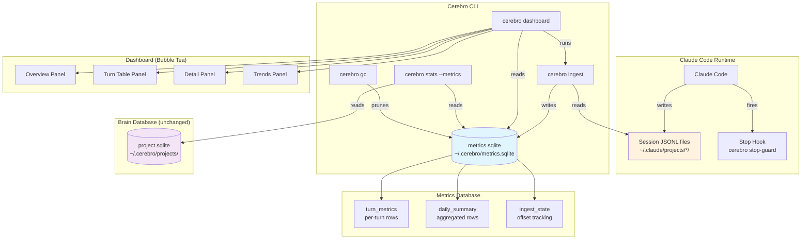

# Observability Architecture: Per-Turn Metrics and Interactive Dashboard

**Date:** 2026-04-23
**Author:** Principal Architect
**Status:** Proposal for review
**Branch:** `feat/harness-phase0`
**Inputs:** consolidated-harness-proposal.md, approach.md (Section 3.1, #42796 data), JSONL session file analysis, Bubble Tea/Bubbles/Lip Gloss documentation (Context7), codebase audit

---

## 0. Design Constraints from the User

Two constraints override the original consolidated proposal's assumptions:

1. **Per-turn, not per-session.** The user runs single long sessions (hours/days), clearing context periodically. A per-session aggregate is blind to within-session dynamics. Every metric must be attributable to a specific turn within a session.

2. **Full interactive dashboard is first-class.** The user accepts complexity if it serves insight. A Bubble Tea dashboard is not deferred -- it ships alongside the sparkline CLI views. The dashboard provides deep drill-down; sparklines provide at-a-glance health.

---

## 1. Defining a "Turn"

### 1.1 What the JSONL tells us

Analysis of 12 session files (11MB total, 1,088 user messages, 1,563 assistant messages) reveals the following structure:

- Each JSONL line has a `type` field: `user`, `assistant`, `system`, `file-history-snapshot`, `attachment`, etc.
- Messages form a tree via `uuid` and `parentUuid` fields. Claude Code uses branching (sidechains) for retries and agent subthreads.
- A single "turn" in the user's experience is: **one user prompt followed by all assistant messages before the next user prompt on the main chain** (excluding sidechains where `isSidechain: true`).
- Within a turn, the assistant may produce 1-5 messages (median 1, mean 1.6). Each message contains zero or more `tool_use` blocks and zero or one `thinking` blocks.
- Each assistant message carries a `message.usage` object with `input_tokens`, `output_tokens`, `cache_creation_input_tokens`, `cache_read_input_tokens`, and an `iterations[]` array.

### 1.2 Turn definition

A **turn** is defined as:

```
Turn N = {
  trigger:    The Nth non-sidechain user message (type=user, isSidechain=false)
  responses:  All non-sidechain assistant messages whose parentUuid chain
              traces back to this user message, before the next user message
}
```

**Edge cases:**
- **Multiple user messages before any assistant response** (e.g., multi-part prompt with attachments): The last user message is the trigger; earlier ones are context. This matches the user's experience of "I sent a prompt."
- **Sidechain messages:** Excluded from turn metrics. They represent retries, agent subthreads, or abandoned branches. They are noise for quality measurement.
- **System messages and hooks:** Not part of turns. They are infrastructure, not user interaction.

### 1.3 Turn ordering

Turns are numbered sequentially within a session starting at 1. The turn number is the primary axis for all per-turn visualizations.

---

## 2. Data Model: `turn_metrics` Table

### 2.1 Schema

```sql
CREATE TABLE IF NOT EXISTS turn_metrics (
    id              INTEGER PRIMARY KEY AUTOINCREMENT,
    session_id      TEXT NOT NULL,
    turn_number     INTEGER NOT NULL,
    timestamp       TEXT NOT NULL,          -- ISO 8601 of the user message

    -- Token economics
    input_tokens          INTEGER NOT NULL DEFAULT 0,
    output_tokens         INTEGER NOT NULL DEFAULT 0,
    cache_read_tokens     INTEGER NOT NULL DEFAULT 0,
    cache_create_tokens   INTEGER NOT NULL DEFAULT 0,

    -- Thinking depth
    thinking_chars        INTEGER NOT NULL DEFAULT 0,  -- 0 = zero-thinking turn
    thinking_blocks       INTEGER NOT NULL DEFAULT 0,

    -- Tool usage (aggregated across all assistant messages in this turn)
    tool_calls_total      INTEGER NOT NULL DEFAULT 0,
    tool_reads            INTEGER NOT NULL DEFAULT 0,  -- Read, Grep, Glob, Bash(read-like)
    tool_edits            INTEGER NOT NULL DEFAULT 0,  -- Edit, Write
    tool_bash             INTEGER NOT NULL DEFAULT 0,
    tool_other            INTEGER NOT NULL DEFAULT 0,

    -- Derived quality signals (computed at insert time)
    read_edit_ratio       REAL,            -- NULL if tool_edits = 0
    output_input_ratio    REAL,            -- output_tokens / input_tokens; proxy for original work vs echo
    assistant_messages    INTEGER NOT NULL DEFAULT 1,  -- messages in this turn's response

    -- Stop guard
    stop_guard_fired      INTEGER NOT NULL DEFAULT 0,  -- 1 if stop-guard blocked this turn

    UNIQUE(session_id, turn_number)
);

CREATE INDEX IF NOT EXISTS idx_turn_metrics_session ON turn_metrics(session_id);
CREATE INDEX IF NOT EXISTS idx_turn_metrics_timestamp ON turn_metrics(timestamp);
CREATE INDEX IF NOT EXISTS idx_turn_metrics_session_turn ON turn_metrics(session_id, turn_number);
```

### 2.2 Field rationale -- every field maps to an intervention lever

| Field | What it measures | Intervention lever | Source evidence |
|-------|------------------|--------------------|-----------------|
| `thinking_chars` | V1: Thinking depth. Zero = zero-thinking turn. | User can check if `effort: high` is working; detect adaptive thinking under-allocation | Boris Cherny HN item 47668520: zero thinking tokens confirmed |
| `thinking_blocks` | Whether thinking happened at all | Same as above; count=0 is the most alarming signal | Same |
| `read_edit_ratio` | V5: Research-before-action | Stop-guard + /implement skill enforcement; if ratio stays low despite interventions, escalate to PreToolUse hook | #42796: ratio dropped 6.6 to 2.0 |
| `tool_reads` / `tool_edits` | Raw counts for ratio computation | Identifies which turns had blind edits | #42796 methodology |
| `input_tokens` / `cache_read_tokens` | V2/V3: Context window and cache health | Detect cache misses (cache_read=0 when context is large = re-read from scratch = expensive turn) | ArkNill analysis, #40524 |
| `cache_create_tokens` | Cache churn | High cache_create on non-first turns = context changed radically = possible compaction or branch switch | Inferred from JSONL structure |
| `output_input_ratio` | V5: Original work vs context echo | Low ratio on complex tasks = model is consuming context but producing little (thinking failure). Very high ratio = model generating without reading (hallucination risk) | Novel signal, no prior evidence; should be validated |
| `stop_guard_fired` | V5: Premature stopping frequency | Direct measure of stop-guard effectiveness per turn | #42796: 0 to 173 violations |
| `assistant_messages` | Turn complexity | Multi-message turns (3+) indicate agentic loops (tool call chains); useful for identifying where the model gets stuck in loops | Observed in JSONL: max 5 messages/turn |

### 2.3 Fields explicitly NOT included (and why)

| Candidate field | Reason for exclusion |
|----------------|----------------------|
| `model_id` / `slug` | Available in JSONL (`slug` field on assistant messages) but not actionable per-turn. If needed, store as session-level metadata, not per-row. |
| `response_latency_ms` | Not available from JSONL (timestamps exist but measure JSONL write time, not API latency). Would require PostToolUse hook instrumentation -- adds runtime overhead for a metric with no intervention lever. |
| `user_prompt_length` | Interesting but not actionable. The user cannot control their own prompt verbosity in real-time. |
| `error_count` | Tool errors are visible in JSONL but would require parsing tool_result blocks. Defer until a specific use case emerges. |
| `code_diff_size` | Would require parsing Edit/Write tool inputs. Extremely complex for marginal signal. |

---

## 3. Collection Strategy Decision

### 3.1 Options evaluated

| Strategy | Mechanism | Latency impact | Data completeness | Complexity |
|----------|-----------|---------------|-------------------|------------|
| **A: PostToolUse hook** | Fires after every tool call. Writes metrics to SQLite in real-time. | Adds ~5-15ms per tool call (SQLite write). Across 234K tool calls (#42796 scale) this is measurable. | Real-time but only sees tool_use blocks, not thinking or usage data. | Medium. Needs stateful tracking (which user message is the current turn). |
| **B: Periodic JSONL parsing** | Batch-process JSONL files on demand, at session end, or on user prompt. | Zero runtime overhead. | Complete -- JSONL has all fields (thinking, usage, tools, timestamps). | Low-medium. Parser is stateless -- read file, emit metrics. |
| **C: Hybrid** | PostToolUse for tool counts (real-time), batch JSONL for thinking/tokens. | ~5-15ms per tool call for partial data. | Two data sources to reconcile. | High. Merge logic, deduplication, consistency. |

### 3.2 Decision: Option B -- Periodic JSONL parsing

**Rationale:**

1. **Zero runtime overhead.** The harness proposal's core value is quality enforcement, not observability. Adding latency to every tool call for metrics collection works against the goal. The user's sessions are already long (hours/days) -- real-time metrics are not needed during the session itself. The value is in post-hoc analysis: "what happened in that session?" and "is the trend degrading over time?"

2. **Data completeness.** The JSONL contains everything: thinking blocks, usage data, tool_use blocks, timestamps, tree structure. A PostToolUse hook would only see the tool call it just processed -- it cannot see thinking depth or token usage. Option B is strictly more complete.

3. **Simplicity.** A single JSONL parser produces the complete `turn_metrics` row. No stateful hook tracking, no reconciliation between data sources, no race conditions.

4. **JSONL files already exist.** Claude Code writes them. We are reading, not creating. No new write paths, no new failure modes.

5. **Incremental parsing is straightforward.** Track the last-processed byte offset per file. On next run, seek to that offset and process only new lines. This makes repeated invocations cheap even for large files.

**When parsing runs:**

| Trigger | Mechanism | Rationale |
|---------|-----------|-----------|
| `cerebro ingest` (explicit) | New CLI subcommand | User runs when they want to see metrics. Manual, no overhead. |
| SessionEnd hook | `cerebro ingest -p "$CLAUDE_PROJECT_DIR"` added to settings.json template | Automatic at session end. Session is already over -- latency is irrelevant. |
| Dashboard launch | `cerebro dashboard` runs ingest before rendering | Ensures data is current when the user asks for it. |
| UserPromptSubmit hook (deferred) | NOT in initial implementation | Would provide live-updating metrics but adds complexity and slight latency. Only if the user demonstrates need for within-session live views. |

**Risk:** JSONL format is not a documented stable API from Anthropic. Field names or structure could change between Claude Code versions. **Mitigation:** The parser validates field presence and treats missing fields as zero/null rather than failing. A `claude_code_version` field exists on every JSONL line -- the parser can branch on version if needed.

---

## 4. Separate Metrics DB vs Brain DB

### 4.1 Decision: Separate SQLite database

The metrics database is stored at `~/.cerebro/metrics.sqlite`, separate from per-project brain databases.

**Rationale:**

1. **Different lifecycle.** Brain data is per-project and follows the project's lifetime. Metrics data spans all projects in a single view. Querying "how did quality trend this week across all my projects?" requires a single database, not N project databases.

2. **Different retention.** Brain nodes are curated, consolidated, and archived with semantic intent. Turn metrics are append-only time-series data with fixed retention. Mixing them creates GC complexity -- the existing GC logic (decay rates, importance thresholds) is meaningless for time-series rows.

3. **Bloat isolation.** Per-turn metrics at the observed rate (286 turns per 3MB session, 1,088 total user messages across 12 sessions in ~4 weeks) produce approximately:

   ```
   Current data:     ~1,088 rows
   Per month (est):  ~4,000 rows (based on observed 4-week usage)
   Per year (est):   ~48,000 rows
   Row size (est):   ~200 bytes per row (integers + one TEXT session_id + one TEXT timestamp)
   Annual DB size:   ~10MB raw + indexes (~15MB total)
   ```

   This is small. 15MB/year of metrics data will not cause storage problems. The concern about bloat is unfounded at this scale.

4. **Portable.** A single `metrics.sqlite` file can be copied, backed up, or analyzed with any SQLite tool without touching brain data.

### 4.2 Retention policy

| Policy | Threshold | Rationale |
|--------|-----------|-----------|
| Keep raw turn data | 90 days | Sufficient for trend analysis. 90 days at ~4,000 rows/month = ~12,000 rows = ~3MB. |
| Keep daily aggregates | Indefinitely | One row per day with min/max/avg/p50 of each metric. ~365 rows/year = negligible. |
| Auto-prune | On `cerebro ingest` or `cerebro gc` | Delete raw rows older than 90 days. Aggregate before deletion. |

### 4.3 Daily aggregate table

```sql
CREATE TABLE IF NOT EXISTS daily_summary (
    id              INTEGER PRIMARY KEY AUTOINCREMENT,
    date            TEXT NOT NULL,         -- YYYY-MM-DD
    session_count   INTEGER NOT NULL DEFAULT 0,
    turn_count      INTEGER NOT NULL DEFAULT 0,

    -- Token aggregates
    total_input_tokens    INTEGER NOT NULL DEFAULT 0,
    total_output_tokens   INTEGER NOT NULL DEFAULT 0,
    total_cache_read      INTEGER NOT NULL DEFAULT 0,
    total_cache_create    INTEGER NOT NULL DEFAULT 0,

    -- Thinking depth
    zero_thinking_turns   INTEGER NOT NULL DEFAULT 0,  -- turns with thinking_chars = 0
    avg_thinking_chars    REAL,
    max_thinking_chars    INTEGER,

    -- Read:edit ratio
    avg_read_edit_ratio   REAL,
    min_read_edit_ratio   REAL,

    -- Stop guard
    stop_guard_fires      INTEGER NOT NULL DEFAULT 0,

    -- Tool totals
    total_tool_calls      INTEGER NOT NULL DEFAULT 0,
    total_reads           INTEGER NOT NULL DEFAULT 0,
    total_edits           INTEGER NOT NULL DEFAULT 0,

    UNIQUE(date)
);
```

### 4.4 Ingest state tracking

```sql
CREATE TABLE IF NOT EXISTS ingest_state (
    file_path       TEXT PRIMARY KEY,
    last_offset     INTEGER NOT NULL DEFAULT 0,   -- byte offset of last processed position
    last_timestamp  TEXT,                           -- timestamp of last processed line
    updated_at      TEXT NOT NULL DEFAULT (datetime('now'))
);
```

This enables incremental parsing: on each `cerebro ingest` run, the parser reads only new bytes appended since last run.

---

## 5. `cerebro ingest` Subcommand

### 5.1 Specification

```
Usage: cerebro ingest [--session-dir DIR] [--force]

Parses Claude Code JSONL session files and populates the metrics database.

Options:
  --session-dir DIR   Override JSONL directory (default: auto-detect from $CLAUDE_PROJECT_DIR)
  --force             Re-parse all files from the beginning, ignoring saved offsets

Behavior:
  1. Opens/creates ~/.cerebro/metrics.sqlite
  2. Applies schema (turn_metrics, daily_summary, ingest_state)
  3. For each .jsonl file in the session directory:
     a. Check ingest_state for last_offset
     b. Seek to offset (or 0 if --force)
     c. Parse lines, build turns, compute metrics
     d. INSERT OR IGNORE into turn_metrics
     e. Update ingest_state with new offset
  4. Aggregate any days not yet in daily_summary
  5. Prune turn_metrics rows older than 90 days (if any)
  6. Print summary: "Ingested N new turns from M files"

Exit code: 0 on success, 1 on error.
```

### 5.2 JSONL parser algorithm

```
Input:  JSONL lines from a single session file
Output: []TurnMetrics rows

State:
  current_turn = nil
  turn_number  = 0
  turns        = []

For each line:
  obj = JSON.parse(line)

  if obj.type == "user" AND NOT obj.isSidechain:
    if current_turn != nil:
      turns.append(current_turn.finalize())
    turn_number++
    current_turn = new Turn(
      session_id:  obj.sessionId,
      turn_number: turn_number,
      timestamp:   obj.timestamp,
    )

  if obj.type == "assistant" AND NOT obj.isSidechain:
    if current_turn == nil:
      skip  // assistant message before any user message (e.g., hook output)

    current_turn.assistant_messages++

    for block in obj.message.content:
      if block.type == "thinking":
        current_turn.thinking_chars += len(block.thinking)
        current_turn.thinking_blocks++
      if block.type == "tool_use":
        current_turn.tool_calls_total++
        classify_tool(block.name, current_turn)  // increments reads/edits/bash/other

    usage = obj.message.usage
    current_turn.input_tokens  += usage.input_tokens
    current_turn.output_tokens += usage.output_tokens
    current_turn.cache_read_tokens  += usage.cache_read_input_tokens
    current_turn.cache_create_tokens += usage.cache_creation_input_tokens

// Flush final turn
if current_turn != nil:
  turns.append(current_turn.finalize())

return turns
```

### 5.3 Tool classification

```go
func classifyTool(name string) ToolCategory {
    switch name {
    case "Read", "Grep", "Glob":
        return ToolRead
    case "Edit", "Write":
        return ToolEdit
    case "Bash":
        return ToolBash  // Could be read or write; counted separately
    default:
        return ToolOther
    }
}
```

**Note on Bash:** Bash commands can be read-like (`git status`, `ls`) or write-like (`go build`, `rm`). Classifying them would require parsing the command string, which is fragile. Instead, Bash is tracked as its own category. The read:edit ratio uses only the unambiguous Read/Grep/Glob vs Edit/Write counts.

### 5.4 Session directory auto-detection

The JSONL files live at `~/.claude/projects/<encoded-project-path>/`. The encoded path is the project directory with `/` replaced by `-` and prefixed with `-`. For example:

```
Project: /Users/q/projects/agentic/cerebro
JSONL:   ~/.claude/projects/-Users-q-projects-agentic-cerebro/*.jsonl
```

The `cerebro ingest` command will:
1. If `--session-dir` is provided, use it directly.
2. Otherwise, use `$CLAUDE_PROJECT_DIR` to derive the encoded path.
3. Glob for `*.jsonl` files in that directory.

For global metrics (across all projects), a future `--all` flag can scan all subdirectories of `~/.claude/projects/`.

---

## 6. Dashboard Architecture

### 6.1 Command

```
cerebro dashboard [--session ID] [--last N]
```

- Default: shows all ingested data, most recent session first.
- `--session ID`: filter to a specific session.
- `--last N`: show only the last N turns (useful for large sessions).

Invoked as `cerebro dashboard`, not `cerebro stats --dashboard`. Rationale: `stats` is a point-in-time brain health check (node counts, schema version). `dashboard` is a time-series quality observatory. They serve different purposes and deserve separate commands.

### 6.2 Bubble Tea application structure

```
internal/dashboard/
    dashboard.go      -- tea.Model, Init/Update/View, top-level layout
    panels.go         -- panel definitions (overview, turn table, detail, trend)
    sparkline.go      -- Unicode sparkline renderer (reusable for CLI too)
    styles.go         -- Lip Gloss style definitions
    queries.go        -- SQL queries against metrics.sqlite
    types.go          -- view models, panel state
```

The dashboard is a **new internal package**, not part of the brain or store packages. It depends only on `metrics.sqlite` (read-only) and the Charm stack. It does NOT import `brain/` or `internal/store/`.

### 6.3 Panel layout

The dashboard uses a tabbed layout with four panels. Tab navigation via left/right arrow or number keys (1-4).

```
+-----------------------------------------------------------------------+
|  Cerebro Dashboard                              Session: 5714a20e...  |
|  [1:Overview]  [2:Turns]  [3:Detail]  [4:Trends]          q: quit    |
+-----------------------------------------------------------------------+

Panel 1: OVERVIEW (default view on launch)
+-----------------------------------+-----------------------------------+
|  Session Summary                  |  Quality Signals                  |
|                                   |                                   |
|  Session: 5714a20e (current)      |  Read:Edit Ratio                  |
|  Duration: 4h 23m                 |  ------                           |
|  Turns: 286                       |  Current: 3.2  Avg: 4.1           |
|  Total tokens: 1.2M in / 340K out|  Trend: [sparkline.............]  |
|  Cache hit rate: 78%              |                                   |
|  Stop guard fires: 3             |  Thinking Depth                   |
|                                   |  ------                           |
|                                   |  Zero-thinking turns: 17 (5.9%)  |
|                                   |  Avg chars: 842                   |
|                                   |  Trend: [sparkline.............]  |
|                                   |                                   |
|                                   |  Cache Efficiency                 |
|                                   |  ------                           |
|                                   |  Hit rate: [sparkline...........]  |
+-----------------------------------+-----------------------------------+

Panel 2: TURNS (scrollable table, sorted by turn number descending)
+-----------------------------------------------------------------------+
| # | Time  | In Tok | Out Tok | Think | R:E | Reads | Edits | Tools   |
|---|-------|--------|---------|-------|-----|-------|-------|---------|
| 286 | 16:39 | 45K  |   2.1K  |  1.2K | 4.0 |   4   |   1   |   7   |
| 285 | 16:35 |  42K  |     890 |     0 |  -- |   0   |   0   |   1   |  <-- zero thinking!
| 284 | 16:31 |  41K  |   3.4K  |  1.9K | 6.0 |   6   |   1   |   9   |
| ...                                                                   |
+-----------------------------------------------------------------------+
| j/k: scroll  Enter: detail  s: sort column  /: filter                 |
+-----------------------------------------------------------------------+

Panel 3: DETAIL (shows full metrics for the selected turn from Panel 2)
+-----------------------------------------------------------------------+
|  Turn 285 Detail                                                      |
|  Timestamp: 2026-04-23T16:35:12Z                                     |
|                                                                       |
|  Token Breakdown           Tool Calls                                 |
|  ----------------          ----------                                 |
|  Input:     42,100         Reads:   0                                 |
|  Output:       890         Edits:   0                                 |
|  Cache read: 41,800        Bash:    1                                 |
|  Cache create:   0         Other:   0                                 |
|  Output/Input: 0.021       Total:   1                                 |
|                                                                       |
|  Thinking                  Quality Flags                              |
|  --------                  -------------                              |
|  Blocks: 0                 [!] ZERO THINKING                          |
|  Chars:  0                 [!] NO READS BEFORE ACTION                 |
|                            [ ] Stop guard: not fired                  |
|                                                                       |
|  Context: 3 turns before had avg R:E of 5.2 -- this turn is anomalous|
+-----------------------------------------------------------------------+

Panel 4: TRENDS (multi-session or within-session time series)
+-----------------------------------------------------------------------+
|  Trend View: Last 7 days                                              |
|                                                                       |
|  Read:Edit Ratio (daily avg)                                          |
|  +-+--+--+--+--+--+--+                                               |
|  |            *       |  6.0                                          |
|  |     *  *     *     |  4.0                                          |
|  |  *              *  |  2.0                                          |
|  +-+--+--+--+--+--+--+                                               |
|   Apr17  19  21  23                                                   |
|                                                                       |
|  Zero-Thinking Turn % (daily)                                         |
|  +-+--+--+--+--+--+--+                                               |
|  |              *     |  15%                                          |
|  |        *  *     *  |  10%                                          |
|  |  *  *              |   5%                                          |
|  +-+--+--+--+--+--+--+                                               |
|   Apr17  19  21  23                                                   |
|                                                                       |
|  [d: daily] [w: weekly] [s: session] [1-4: switch panel]             |
+-----------------------------------------------------------------------+
```

### 6.4 Component architecture (Bubble Tea Model-View-Update)

```go
// Top-level model
type DashboardModel struct {
    activeTab    int              // 0-3
    tabs         []string         // ["Overview", "Turns", "Detail", "Trends"]
    overview     OverviewPanel
    turnTable    TurnTablePanel
    detail       DetailPanel
    trends       TrendsPanel
    db           *sql.DB          // read-only handle to metrics.sqlite
    width        int
    height       int
    err          error
}

// Each panel implements this interface
type Panel interface {
    Init(db *sql.DB) tea.Cmd
    Update(msg tea.Msg) (Panel, tea.Cmd)
    View(width, height int) string
    ShortHelp() string
}
```

Key design decisions:

1. **Load-on-demand, not real-time refresh.** Data is loaded when the dashboard launches (after running ingest) and when the user presses `r` to refresh. No background ticking or polling. Rationale: the JSONL files are static once the session is over. During an active session, the user is interacting with Claude, not staring at a dashboard. If live-updating is needed later, a `tea.Tick` command can be added with a 30-second interval.

2. **Alt-screen mode.** The dashboard uses `tea.WithAltScreen()` so it does not pollute the terminal scrollback. On exit, the terminal is restored cleanly.

3. **Mouse support.** Enabled via `tea.WithMouseCellMotion()` for viewport scrolling in the turn table.

4. **The turn table (Panel 2) is the central navigation hub.** Selecting a row and pressing Enter populates the Detail panel (Panel 3). Sorting by any column (press `s` then column letter) reorders the table. Filtering (press `/` then type) narrows to matching rows.

### 6.5 Sparkline renderer

A reusable sparkline function for both the dashboard and the CLI `cerebro stats` enhancement:

```go
// internal/dashboard/sparkline.go (also importable by cmd layer)

// Sparkline renders a slice of float64 values as a Unicode sparkline string.
// Uses the Unicode Block Elements: U+2581 through U+2588 (8 levels).
func Sparkline(values []float64, width int) string
```

The sparkline renders the most recent `width` data points. If fewer data points exist, it pads from the left with spaces.

Characters: `_` `▁` `▂` `▃` `▄` `▅` `▆` `▇` `█` (underscore for zero, 8 block elements for non-zero scaled to min/max).

### 6.6 CLI sparkline view (enhancement to `cerebro stats`)

The existing `cerebro stats` command gets a new `--metrics` flag that appends per-turn sparklines below the brain health data:

```
$ cerebro stats --metrics

Brain: cerebro (schema v2, 47 nodes, 31 edges)
...existing stats output...

Session Metrics (last 50 turns):
  Read:Edit  ▃▅▇▅▃▄▆▇▅▂_▃▅▇▆▄▃▅▆▇▅▃▄▅▆▇▅▃▂▃▅▆▇▅▃▄▅▆▇▅▃▂▃▅▆▇▅▃▄
  Thinking   ▅▆▇▅▃▄▆▇__▂▃▅▇▆▄▃▅▆▇▅▃▄▅▆▇_▃▂▃▅▆▇▅▃▄▅▆▇▅▃▂▃▅▆▇▅▃▄
  Cache Hit  ▇▇▇▇▇▅▇▇▇▇▂▇▇▇▇▇▇▇▇▇▇▇▇▇▇▇▇▇▇▇▇▇▇▇▇▇▇▇▇▇▇▅▇▇▇▇▇▇
  Stop Guard _______________________*______________________________

  Legend: _ = zero/none, * = stop guard fired
  Avg R:E: 4.1  Zero-think: 5.9%  Cache hit: 78%
```

This is the quick CLI view. The dashboard is for deep analysis.

---

## 7. Metrics That Matter at Per-Turn Granularity

### 7.1 Actionable per-turn (primary metrics)

These metrics are meaningful on individual turns and directly map to an intervention:

| Metric | Per-turn signal | Intervention |
|--------|----------------|--------------|
| `thinking_chars == 0` | **Zero-thinking turn.** The model skipped reasoning entirely. | Check if `effort: high` is set. Check if adaptive thinking is under-allocating. If persistent, file upstream report with turn-level evidence. |
| `read_edit_ratio < 2.0` | **Blind edit.** Model edited without sufficient research. | `/implement` skill should prevent this. If ratio is low despite /implement, escalate to PreToolUse hook. |
| `tool_edits > 0 AND tool_reads == 0` | **Edit without any reads in this turn.** The most severe form of V5 degradation. | Immediate flag. Stop-guard should catch this indirectly (scope reduction language often accompanies blind edits). |
| `stop_guard_fired` | **Premature stop attempt.** Model tried to stop early. | Stop-guard already handled it by blocking. The metric tracks frequency -- increasing fire rate over time means the underlying problem is worsening. |
| `cache_read_tokens == 0 AND input_tokens > 10000` | **Full cache miss on a large context.** Possible compaction, or prompt caching bug (V2). | Check if this turn followed a long gap (user walked away). If frequent without gaps, investigate V2. |

### 7.2 Meaningful as trends (secondary metrics)

These are not individually actionable but reveal degradation when aggregated:

| Metric | Trend signal | What it tells you |
|--------|-------------|-------------------|
| `avg(thinking_chars)` over 10-turn window | Declining thinking depth | Model is doing less reasoning per turn. Early warning of V1/V4. |
| `avg(read_edit_ratio)` over 10-turn window | Declining research effort | The "slow slide" that #42796 documented. |
| `sum(output_tokens) / sum(input_tokens)` per day | Output efficiency | Trending down = model producing less per context token consumed. |
| `count(zero_thinking_turns) / count(*)` per day | Zero-thinking rate | Percentage of turns with no reasoning. Should be under 5%. |
| `sum(stop_guard_fires)` per day | Stop-guard fire rate | Should be low. Increasing = V5 worsening. |

### 7.3 Not worth tracking (rejected)

| Candidate | Why rejected |
|-----------|-------------|
| "Hallucination count" | Not detectable from JSONL. Would require an evaluator agent (Phase 3 of harness proposal). No structured signal exists. |
| "Code quality score" | Subjective. No automated proxy that isn't more complex than the code it measures. |
| "User satisfaction per turn" | Would require user input (thumbs up/down). Adds friction. Defer to a future "annotate" feature if needed. |
| "Time between user messages" | Measures the user's behavior, not the model's. Not actionable. |
| "Token cost in dollars" | Depends on plan (Pro/Max/API). Not universally computable. The user knows their plan; raw token counts are more useful. |

---

## 8. New Dependencies

| Package | Purpose | Size impact | Context7 verified |
|---------|---------|-------------|-------------------|
| `charmbracelet/bubbletea` | TUI framework for dashboard | ~2MB compiled | Yes -- MVU architecture, tea.Tick, alt-screen, mouse support confirmed |
| `charmbracelet/bubbles` | Table, viewport, spinner components | Included with bubbletea ecosystem | Yes -- table.New with columns/rows, viewport for scrolling, styles confirmed |
| `charmbracelet/lipgloss` | Terminal styling, layout, borders | Included with bubbletea ecosystem | Yes -- JoinHorizontal/Vertical, Border, table sub-package confirmed |

These are the standard Charm stack. Well-maintained, widely used in Go TUI applications. No CGO required (unlike sqlite-vec). The dashboard binary size increase is approximately 2-3MB.

**Note:** The Charm libraries are only imported by `internal/dashboard/` and `cmd/cerebro/`. They do not affect the `brain/` public API or `internal/store/`.

---

## 9. Implementation Phases

### Phase A: Data layer (`cerebro ingest` + metrics DB)

| # | Deliverable | Files | Tests |
|---|-------------|-------|-------|
| A1 | Metrics DB schema + open/migrate | `internal/metrics/schema.go`, `internal/metrics/store.go` | Schema creation, migration, open/close |
| A2 | JSONL parser (turn extraction) | `internal/metrics/parser.go` | Parse empty file, parse single turn, parse multi-message turn, skip sidechains, handle malformed lines |
| A3 | Ingest logic (incremental, offset tracking) | `internal/metrics/ingest.go` | Full ingest, incremental ingest, force re-ingest, daily aggregation |
| A4 | `cerebro ingest` CLI command | `cmd/cerebro/cmd_ingest.go` | Integration test with fixture JSONL |
| A5 | SessionEnd hook update | `templates/settings.json` modification | Scaffold test: ingest hook present |

### Phase B: CLI sparklines (`cerebro stats --metrics`)

| # | Deliverable | Files | Tests |
|---|-------------|-------|-------|
| B1 | Sparkline renderer | `internal/dashboard/sparkline.go` | Empty input, single value, all-same values, varied values, width truncation |
| B2 | `cerebro stats --metrics` flag | Modified `cmd/cerebro/cmd_stats.go` | Output includes sparkline lines when --metrics flag set |

### Phase C: Interactive dashboard (`cerebro dashboard`)

| # | Deliverable | Files | Tests |
|---|-------------|-------|-------|
| C1 | Dashboard model + layout | `internal/dashboard/dashboard.go`, `styles.go`, `types.go` | Model initializes, tab switching works |
| C2 | Overview panel | `internal/dashboard/panel_overview.go` | Renders summary from DB |
| C3 | Turn table panel | `internal/dashboard/panel_turns.go` | Table populates, sorting works, selection updates detail |
| C4 | Detail panel | `internal/dashboard/panel_detail.go` | Renders selected turn metrics, flags anomalies |
| C5 | Trends panel | `internal/dashboard/panel_trends.go` | Renders sparklines for date range, aggregation switching |
| C6 | `cerebro dashboard` CLI command | `cmd/cerebro/cmd_dashboard.go` | Smoke test: command exists, opens DB |

### Phase D: Retention + integration

| # | Deliverable | Files | Tests |
|---|-------------|-------|-------|
| D1 | Auto-prune on ingest (90-day raw, aggregate before delete) | `internal/metrics/retention.go` | Prune removes old rows, aggregates preserved, recent rows untouched |
| D2 | `--all` flag for cross-project ingest | Modified `cmd/cerebro/cmd_ingest.go` | Ingests from multiple project dirs |

---

## 10. Interface Definitions

### 10.1 Metrics store interface

```go
// internal/metrics/store.go

// MetricsStore handles the metrics SQLite database.
type MetricsStore struct {
    db *sql.DB
}

// Open opens or creates the metrics database at the given path.
func Open(path string) (*MetricsStore, error)

// Close closes the database connection.
func (s *MetricsStore) Close() error

// InsertTurnMetrics inserts a batch of turn metrics rows.
// Uses INSERT OR IGNORE to handle re-ingestion of already-processed turns.
func (s *MetricsStore) InsertTurnMetrics(rows []TurnMetrics) error

// QueryTurns returns turn metrics matching the given filter.
func (s *MetricsStore) QueryTurns(filter TurnFilter) ([]TurnMetrics, error)

// QueryDailySummary returns daily aggregate rows for a date range.
func (s *MetricsStore) QueryDailySummary(from, to string) ([]DailySummary, error)

// AggregateDays computes daily summaries for dates not yet aggregated.
func (s *MetricsStore) AggregateDays() error

// Prune deletes raw turn_metrics rows older than the given duration
// and ensures daily summaries exist for the pruned dates.
func (s *MetricsStore) Prune(maxAge time.Duration) (int, error)

// GetIngestState returns the last-processed offset for a file.
func (s *MetricsStore) GetIngestState(filePath string) (IngestState, error)

// SetIngestState updates the last-processed offset for a file.
func (s *MetricsStore) SetIngestState(filePath string, state IngestState) error
```

### 10.2 Types

```go
// internal/metrics/types.go

// TurnMetrics represents a single user-turn's quality metrics.
type TurnMetrics struct {
    ID                int64   `json:"id"`
    SessionID         string  `json:"session_id"`
    TurnNumber        int     `json:"turn_number"`
    Timestamp         string  `json:"timestamp"`

    InputTokens       int     `json:"input_tokens"`
    OutputTokens      int     `json:"output_tokens"`
    CacheReadTokens   int     `json:"cache_read_tokens"`
    CacheCreateTokens int     `json:"cache_create_tokens"`

    ThinkingChars     int     `json:"thinking_chars"`
    ThinkingBlocks    int     `json:"thinking_blocks"`

    ToolCallsTotal    int     `json:"tool_calls_total"`
    ToolReads         int     `json:"tool_reads"`
    ToolEdits         int     `json:"tool_edits"`
    ToolBash          int     `json:"tool_bash"`
    ToolOther         int     `json:"tool_other"`

    ReadEditRatio     *float64 `json:"read_edit_ratio"`     // nil if no edits
    OutputInputRatio  *float64 `json:"output_input_ratio"`  // nil if no input
    AssistantMessages int      `json:"assistant_messages"`

    StopGuardFired    bool    `json:"stop_guard_fired"`
}

// DailySummary is the aggregated view for one calendar day.
type DailySummary struct {
    Date               string  `json:"date"`
    SessionCount       int     `json:"session_count"`
    TurnCount          int     `json:"turn_count"`
    TotalInputTokens   int     `json:"total_input_tokens"`
    TotalOutputTokens  int     `json:"total_output_tokens"`
    ZeroThinkingTurns  int     `json:"zero_thinking_turns"`
    AvgThinkingChars   float64 `json:"avg_thinking_chars"`
    AvgReadEditRatio   float64 `json:"avg_read_edit_ratio"`
    MinReadEditRatio   float64 `json:"min_read_edit_ratio"`
    StopGuardFires     int     `json:"stop_guard_fires"`
    TotalToolCalls     int     `json:"total_tool_calls"`
    TotalReads         int     `json:"total_reads"`
    TotalEdits         int     `json:"total_edits"`
}

// TurnFilter specifies query parameters for turn retrieval.
type TurnFilter struct {
    SessionID    string // empty = all sessions
    MinTurn      int    // 0 = from start
    MaxTurn      int    // 0 = to end
    Since        string // ISO 8601 timestamp
    Until        string // ISO 8601 timestamp
    Limit        int    // 0 = no limit
    OrderDesc    bool   // true = most recent first
}

// IngestState tracks incremental parsing progress for a JSONL file.
type IngestState struct {
    FilePath      string `json:"file_path"`
    LastOffset    int64  `json:"last_offset"`
    LastTimestamp string `json:"last_timestamp"`
}
```

### 10.3 Parser interface

```go
// internal/metrics/parser.go

// ParseJSONL reads a JSONL file starting from the given byte offset and
// returns the extracted turn metrics and the new byte offset.
func ParseJSONL(filePath string, fromOffset int64) ([]TurnMetrics, int64, error)
```

---

## 11. Component Diagram



---

## 12. Open Questions

### 12.1 Answerable with implementation

1. **Is the `parentUuid` chain reliable for filtering sidechains?** The analysis shows `isSidechain` is present on JSONL entries. The parser should use `isSidechain` as the primary filter, with `parentUuid` chain-walking as a fallback only if needed. Start with the simple approach.

2. **Does `thinking` content persist in JSONL after redaction?** Analysis of the current files shows 21 thinking blocks, of which 17 are empty (0 chars) and 4 have content (127-1929 chars). The empty ones may be redacted or may be genuine zero-thinking turns. The parser treats all empty thinking blocks as zero-thinking -- this is conservative (may overcount zero-thinking) but safe. If Anthropic restores thinking visibility, the signal improves automatically.

3. **How should `cerebro ingest` handle JSONL files from other projects?** The `--session-dir` flag allows explicit targeting. The default auto-detection uses `$CLAUDE_PROJECT_DIR`. For cross-project analysis, the `--all` flag (Phase D) scans all project directories. Session IDs are globally unique (UUIDs), so no collision risk.

### 12.2 Answerable with usage

4. **Is 90-day retention sufficient?** Start with 90 days. If the user wants longer historical data, increase it via `cerebro config set metrics_retention_days 365`. The daily summaries are kept indefinitely regardless.

5. **Should the stop-guard write directly to metrics.sqlite?** Currently proposed: stop-guard fires are detected during JSONL parsing by matching turn timestamps to stop-guard log entries. Alternative: the stop-guard command itself writes a flag to metrics.sqlite on each fire. The JSONL-only approach is cleaner (single data source), but the direct-write approach gives real-time stop-guard counting. Decision deferred to implementation -- try JSONL-only first.

    **Update:** On reflection, the JSONL does not contain stop-guard fire events. The stop-guard outputs JSON to stdout which Claude Code consumes, but this is not written to the JSONL. To track stop-guard fires, the stop-guard command itself should append to a simple log file (`~/.cerebro/stop-guard.log`) with timestamp and matched phrase. The ingest command can then correlate this log with turn timestamps. Alternatively, the stop-guard can write directly to metrics.sqlite. Either approach works; the log file is simpler and does not require the stop-guard to know about the metrics schema.

### 12.3 Depends on upstream

6. **Will Claude Code JSONL format change?** The parser must be defensive. Version-check the `version` field on each line. If an unknown version is encountered, log a warning and skip the line rather than crashing.

---

## 13. Risk Assessment

| Risk | Impact | Mitigation |
|------|--------|------------|
| JSONL format changes between Claude Code versions | Parser breaks silently (wrong metrics) or loudly (parse errors) | Version-aware parser with defensive field access. Integration tests against fixture files from known versions. |
| Bubble Tea adds 2-3MB to binary size | Larger binary, longer compile times | Acceptable trade-off. The dashboard is a first-class feature, not optional. If size becomes a concern, the dashboard could be a separate binary (`cerebro-dashboard`), but this is premature optimization. |
| Thinking content is always redacted (empty blocks) | `thinking_chars` metric is always 0, losing the V1 signal | The metric still has value: it detects turns where even the empty thinking block is absent (no block at all vs block with 0 chars). Also, if Anthropic restores visibility, the metric works immediately. |
| Metrics DB corruption | Loss of historical metrics | SQLite WAL mode for crash safety. The DB is reconstructable from JSONL files (run `cerebro ingest --force`). |
| Dashboard complexity delays harness Phase 1 | Stop-guard and /implement delayed | Dashboard is a separate work track. Phase order: A (data layer) in parallel with harness Phase 1, then B+C after. |

---

## 14. Relationship to Consolidated Proposal

This document extends the consolidated harness proposal (Section 7.2, "Behavioral measurement") with concrete architecture. It does NOT change any of the harness proposal's accepted decisions. Specifically:

| Harness proposal item | This document's contribution |
|-----------------------|-----------------------------|
| "Read:edit ratio -- Post-hoc from JSONL session files" | Defines exactly how: JSONL parser, turn_metrics table, per-turn R:E ratio. |
| "Stop hook violation count -- Count `{"decision": "block"}` outputs per session" | Proposes stop-guard logging mechanism and ingest correlation. |
| "Phase 2a: PostToolUse logging hook" | **Recommends against PostToolUse for metrics collection.** JSONL parsing is more complete and has zero runtime overhead. PostToolUse logging is only justified if real-time, within-session metrics prove necessary -- and the user's stated use case is post-hoc analysis, not real-time. |

The observability system is independent of the harness phases. It can be built and shipped without waiting for stop-guard, /implement, or any other harness component. It reads existing data (JSONL files) that Claude Code already produces.

---

## 15. Decision Summary

| Decision | Choice | Rationale |
|----------|--------|-----------|
| Granularity | Per-turn (user prompt to assistant response cycle) | User's sessions are hours-long; per-session is meaningless |
| Collection | Batch JSONL parsing via `cerebro ingest` | Zero runtime overhead, complete data, simple |
| Storage | Separate `~/.cerebro/metrics.sqlite` | Different lifecycle, different retention, cross-project queries |
| Retention | 90 days raw, indefinite daily aggregates | ~3MB/90 days at current usage. Configurable. |
| Dashboard | `cerebro dashboard` with Bubble Tea (4 panels: overview, turns, detail, trends) | First-class feature per user requirement |
| CLI view | `cerebro stats --metrics` with sparklines | Quick at-a-glance health |
| TUI stack | charmbracelet/bubbletea + bubbles + lipgloss | Standard Go TUI stack, well-maintained, no CGO |
| Dashboard refresh | Load-on-demand (not live) | Data is static once session ends; live refresh adds complexity without value |
